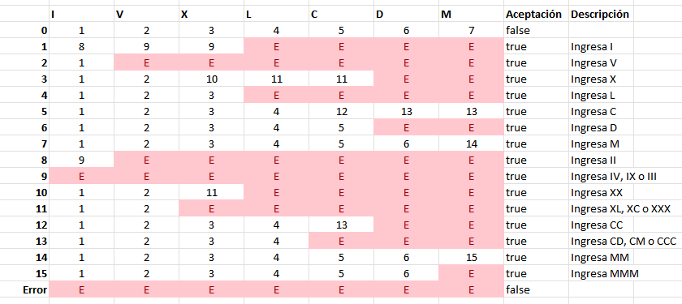

# DFAutomaton

## Overview

A simple Java implementation of a Deterministic Finite Automaton (DFA). This project provides a basic framework to define and run DFAs to recognize specific string patterns based on a given alphabet and a set of state transitions.

The repository includes examples for validating Roman numerals and numeric constants.

## Core Components

*   **`automaton.DFAutomaton`**: The main class that simulates the DFA. It validates input strings against the defined states and transitions.
*   **`automaton.State`**: Represents a single state within the automaton, containing its transitions and whether it is a final (accepting) state.

## Getting Started

### 1. Define Your Alphabet and States

An automaton is defined by an alphabet and an array of states.

*   **Alphabet**: A `String[]`. Each string in the array groups characters that trigger the same transition. For example, `{"0123456789", ".", "E"}`. The index of each string corresponds to a transition path.
*   **States**: A `State[]`. Each `State` object is initialized with:
    *   An `int[]` for transitions. The index of this array corresponds to the index of the symbol in the alphabet. The value at that index is the index of the next state in the `states` array. Use `-1` for invalid transitions (trap state).
    *   A `boolean` indicating if the state is an accepting (valid) final state.

### 2. Create a `DFAutomaton` Instance

Instantiate the `DFAutomaton` class with your alphabet and states array.

```java
DFAutomaton myAutomaton = new DFAutomaton(myAlphabet, myStates);
```

### 3. Test a String

Use the `isAccepted(String entry)` method to check if a string is recognized by the automaton. It returns `true` if the string ends in a valid state and `false` otherwise.

```java
boolean result = myAutomaton.isAccepted("your-test-string");
```

## Examples

The `src/test/DFA.java` file contains complete, runnable examples.

### Example 1: Roman Numeral Validator

This DFA validates a simplified set of Roman numerals.



```java
// Define the alphabet for Roman numerals
String[] romanAlphabet = {"I", "V", "X", "L", "C", "D", "M"};

// Define the state transition table
State[] romanStates = {
    new State(new int[]{1, 2, 3, 4, 5, 6, 7}, false),
    new State(new int[]{8, 9, 9, -1, -1, -1, -1}, true),
    new State(new int[]{1, -1, -1, -1, -1, -1, -1}, true),
    new State(new int[]{1, 2, 10, 11, 11, -1, -1}, true),
    new State(new int[]{1, 2, 3, -1, -1, -1, -1}, true),
    new State(new int[]{1, 2, 3, 4, 12, 13, 13}, true),
    new State(new int[]{1, 2, 3, 4, 5, -1, -1}, true),
    new State(new int[]{1, 2, 3, 4, 5, 6, 14}, true),
    new State(new int[]{9, -1, -1, -1, -1, -1, -1}, true),
    new State(new int[]{-1, -1, -1, -1, -1, -1, -1}, true),
    new State(new int[]{1, 2, 11, -1, -1, -1, -1}, true),
    new State(new int[]{1, 2, -1, -1, -1, -1, -1}, true),
    new State(new int[]{1, 2, 3, 4, 13, -1, -1}, true),
    new State(new int[]{1, 2, 3, 4, -1, -1, -1}, true),
    new State(new int[]{1, 2, 3, 4, 5, 6, 15}, true),
    new State(new int[]{1, 2, 3, 4, 5, 6, -1}, false)
};

// Create and test the automaton
DFAutomaton roman = new DFAutomaton(romanAlphabet, romanStates);
System.out.println("Is 'XVI' a valid roman number?: " + roman.isAccepted("XVI")); // true
System.out.println("Is 'IIII' a valid roman number?: " + roman.isAccepted("IIII")); // false
```

### Example 2: Numeric Constant Validator

This DFA validates numeric constants, including integers, decimals, and scientific notation (e.g., `1.5E-2`).

```java
// Define the alphabet for numeric constants
String[] numAlphabet = {"1234567890", ".", "E", "+-"};

// Define the state transition table
State[] numStates = {
    new State(new int[]{2, 7, -1, 1}, false),
    new State(new int[]{2, 7, -1, -1}, false),
    new State(new int[]{2, 3, 4, -1}, true),
    new State(new int[]{3, -1, 4, -1}, true),
    new State(new int[]{6, -1, -1, 5}, false),
    new State(new int[]{6, -1, -1, -1}, false),
    new State(new int[]{6, -1, -1, -1}, true),
    new State(new int[]{3, -1, -1, -1}, false)
};

// Create and test the automaton
DFAutomaton numeric = new DFAutomaton(numAlphabet, numStates);
System.out.println("Is '.E2' a valid numeric constant?: " + numeric.isAccepted(".E2")); // true
System.out.println("Is '1.5E-2' a valid numeric constant?: " + numeric.isAccepted("1.5E-2")); // true
System.out.println("Is '1.E' a valid numeric constant?: " + numeric.isAccepted("1.E")); // false
```

### How to Run

The project is a standard Java project (originally configured for NetBeans). You can compile the source files and run the `test.DFA` class from the command line.

1.  Navigate to the `src` directory:
    ```sh
    cd src
    ```

2.  Compile the Java files:
    ```sh
    javac automaton/*.java test/*.java
    ```

3.  Run the main test class:
    ```sh
    java test.DFA
    ```

You should see the following output:
```
Is a valid roman number?: true
Is a valid numeric constant?: true
